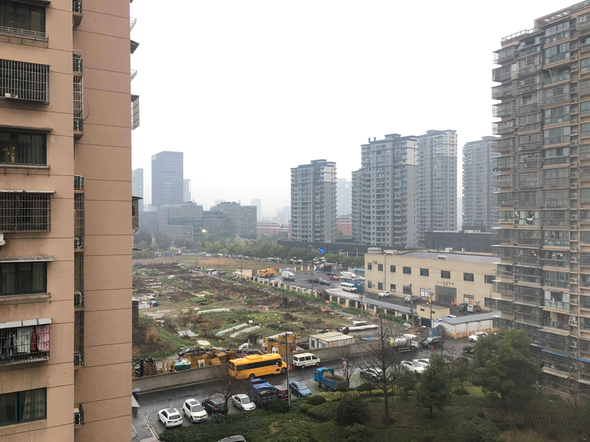

# 史德凯的枯燥生活
```html
<p>hello欢迎进入我的第一个博客</p>
```

我的喜好

* 睡觉
* 看电影
* 打英雄联盟
* 吃火锅

我的经历和未来的规划

1. 中专读软件开发专业一年学习效果不佳学费又贵，故辍学。
2. 在萧山某工厂工作一年离职。
3. 在杭州进入一家财险公司做销售两年。
4. 攒了点小钱在一教育机构报了远程网络专科，预计21年3月拿到文凭。
5. 在知乎刷到饥人谷方方老师的回答和文章，放弃这两年自学的Java报名饥人谷学习前端。
6. 希望自己能努力学习成功转行在杭州凭自己一手技术找到满意的工作。

近期看了一部你可能也看过的影片，很喜欢。如果你没有看过推荐给你~
[三傻大闹宝莱坞](https://www.bilibili.com/bangumi/play/ss29610/?from=search&seid=13803396443185754190)